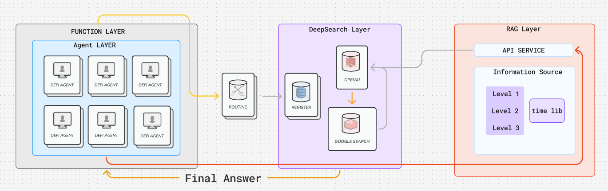
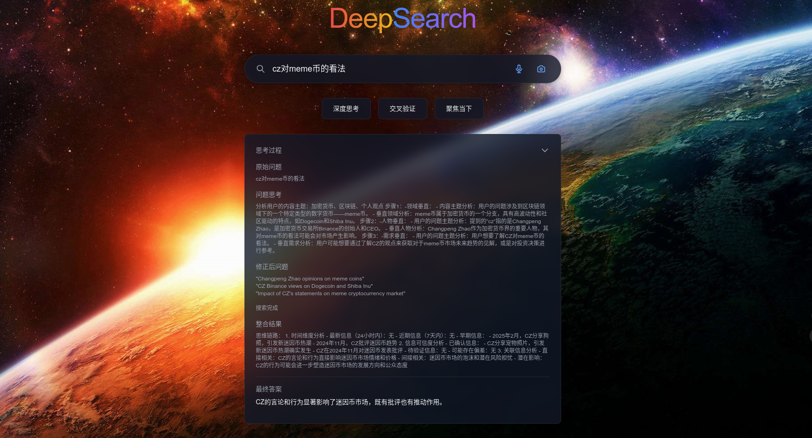
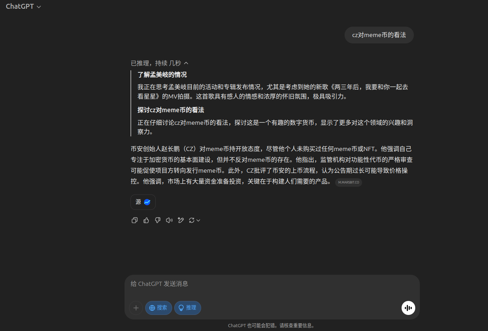

# DeepSearch - 智能信息检索与分析系统

## 介绍

DeepSearch 是一个先进的智能信息检索与分析系统，通过提示词工程和RAG技术，将AI搜索聚焦Web3领域。同时DeepSearch聚集即时信息，进行热点交叉验证，提供最准确的信息来源。同时我们在base测试网路初步部署了预言机服务，用于未来向去中心化Agent提供服务。

## Base链应用场景

在 DeFi Agent 成为潮流的当下,大部分Agent聚焦于技术分析方向，根据技术指标提供智能交易服务。然而市场上大部分赚取的机会源自情绪而非技术，如 Trump 家族代币，阿根廷总统代币等突发事件。DeepSearch 的目标是关注热点事件，通过时间权重计算和短时消息分析，为Base链的 DeFi Agent提供消息面分析支持。

## 主要特性

- 智能查询理解与优化
- 多轮精准搜索
- 深度信息分析与整合
- 清晰的思考过程展示
- 准确的信息溯源

## 执行策略


当通过 DeepSearch 进行问题搜索和消息验证时，首先会通过提示词工程调用模型思维链，将模糊问题聚焦在具体场景、任务、事件等维度。并将结果转化为易于搜索的形式，接着调用搜索AI进行多重搜索，反馈结果后进行信息整合，并利用本地部署的信息库中进行溯源，交叉验证信息真实性。最终实现对区块链垂直领域、热点信息的正确分析。

## 效果对比

DeepSearch(无RAG版本搜索结果)


GPT连网推理搜索结果


## 技术栈

### 前端

- Next.js 15.1.7
- React 19
- TypeScript
- Tailwind CSS
- ESLint

### 后端

- Python FastAPI
- OpenAI API
- Perplexity AI
- Beautiful Soup 4

### RAG

- LangChain
- OpenAI API

## 快速开始

### 环境要求

- Node.js 18+
- Python 3.10+
- 包管理器: npm/yarn

### 安装步骤

#### 克隆仓库

```bash
git clone [repository-url]
cd deepsearch
```

#### 安装前端依赖

```bash
npm install
```

#### 安装后端依赖

```bash
cd information_get
pip install -r requirements.txt
```

#### 环境配置

创建 `.env` 文件并配置以下环境变量：

```bash
OPENAI_API_KEY=your_openai_api_key
```

#### 启动服务

前端开发服务器：

```bash
npm run dev
```

后端API服务器：

```bash
cd information_get
python api.py
```

## 使用指南

1. 访问 `http://localhost:3000` 打开Web界面
2. 在搜索框中输入您的问题
3. 系统会实时显示：
   - 问题优化过程
   - 搜索查询过程
   - 信息收集状态
   - 分析思考过程
   - 最终综合答案

## 可供展示的效果

用户输入信息，系统根据提示词、搜索引擎和RAG库知识，反馈最终答案。

## 许可证

本项目采用 MIT 许可证 - 详见 LICENSE 文件
